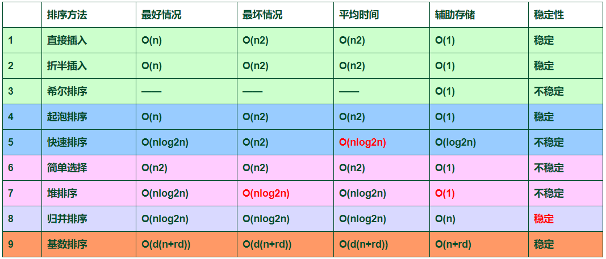

<!--
 * @Version: 0.1
 * @Autor: zmf96
 * @Email: zmf96@qq.com
 * @Date: 2020-12-10 14:16:12
 * @LastEditors: zmf96
 * @LastEditTime: 2020-12-10 14:29:17
 * @FilePath: \My_Data_Structure_Note\docs\排序.md
 * @Description: 
-->

# 排序
<!-- TOC -->

- [1. 基本概念与分类](#1-基本概念与分类)
- [2. 冒泡排序](#2-冒泡排序)
- [3. 简单选择排序](#3-简单选择排序)
- [4. 直接插入排序](#4-直接插入排序)
- [5. 希尔排序](#5-希尔排序)
- [6. 堆排序](#6-堆排序)
- [7. 归并排序](#7-归并排序)
- [8. 快速排序](#8-快速排序)

<!-- /TOC -->

## 1. 基本概念与分类

## 2. 冒泡排序

## 3. 简单选择排序

## 4. 直接插入排序

## 5. 希尔排序

## 6. 堆排序

## 7. 归并排序

## 8. 快速排序
